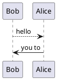

# react_task1_ex1_work

>Unitate

Загаловок таблицы1 | Загаловок таблицы2
-------------------|-------------------
Текст1             | Текст2

```plantumlcode
@startuml
Bob --> Alice: hello
Alice -> Bob: you to
@enduml
```


